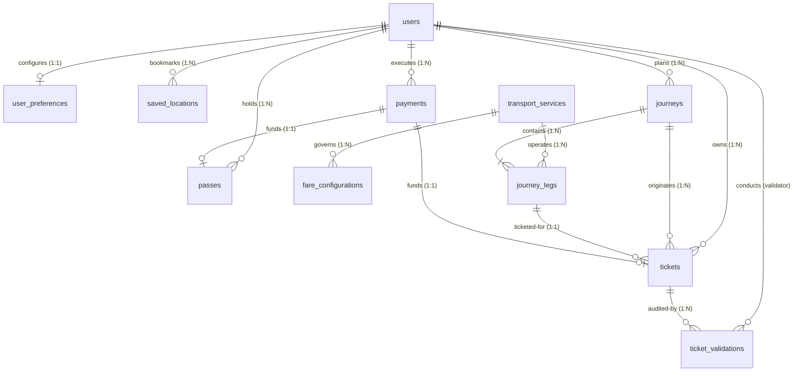

# IntelliTransit — Database Design & Data Architecture

**Platform:** PostgreSQL 14+  
**Primary Database:** `intellitransit`  
**Automated Test Database:** `intellitransit_test`  
**Connection Management:** psycopg2 `ThreadedConnectionPool` (5 min, 20 max connections)  
**Schema Status:** **FROZEN & VERIFIED (11 Core Tables)**

---

## 1. Entity-Relationship Diagram (ERD)

---

## 2. Table Specifications (11 Tables)

### 2.1 `users`
Core identity table storing credentials and RBAC roles.
- `user_id` (`UUID`, PK, `DEFAULT gen_random_uuid()`): Unique identifier.
- `full_name` (`VARCHAR(100)`, NOT NULL): Commuter or administrator name (`CHECK length(trim) > 0`).
- `email` (`VARCHAR(255)`, NOT NULL, UNIQUE): Unique email formatted with regex check.
- `phone` (`VARCHAR(15)`, UNIQUE): 10-digit Indian phone format (`CHECK phone ~* '^[6-9][0-9]{9}$'`).
- `password_hash` (`TEXT`, NOT NULL): bcrypt hash generated with work factor 12.
- `role` (`VARCHAR(20)`, NOT NULL, DEFAULT `'USER'`): Strict RBAC role (`CHECK role IN ('USER', 'ADMIN')`).
- `is_active` (`BOOLEAN`, NOT NULL, DEFAULT `TRUE`): Soft-deletion and account status flag.
- `created_at` (`TIMESTAMP`, NOT NULL, DEFAULT `CURRENT_TIMESTAMP`).
- `updated_at` (`TIMESTAMP`, NOT NULL, DEFAULT `CURRENT_TIMESTAMP`).
- **Indexes:** `idx_users_email`, `idx_users_phone`, `idx_users_role`.

### 2.2 `user_preferences`
Commuter routing customization weights.
- `preference_id` (`UUID`, PK, `DEFAULT gen_random_uuid()`).
- `user_id` (`UUID`, NOT NULL, UNIQUE, FK `users.user_id` `ON DELETE CASCADE`).
- `preferred_mode` (`VARCHAR(20)`): Mode bias (`CHECK IN ('BUS', 'METRO', 'TAXI')`).
- `route_preference` (`VARCHAR(30)`): Optimization profile (`CHECK IN ('FASTEST', 'CHEAPEST', 'LEAST_WALKING', 'FEWEST_TRANSFERS', 'BALANCED')`).
- `max_walking_distance_m` (`INTEGER`): Maximum walking cutoff in meters (`CHECK >= 0`).
- `avoid_taxi` (`BOOLEAN`, NOT NULL, DEFAULT `FALSE`).
- `avoid_transfers` (`BOOLEAN`, NOT NULL, DEFAULT `FALSE`).
- `updated_at` (`TIMESTAMP`, NOT NULL, DEFAULT `CURRENT_TIMESTAMP`).
- **Indexes:** `idx_user_preferences_user_id`.

### 2.3 `saved_locations`
Frequently used commuter stops (Home, Office, University, etc.).
- `location_id` (`UUID`, PK, `DEFAULT gen_random_uuid()`).
- `user_id` (`UUID`, NOT NULL, FK `users.user_id` `ON DELETE CASCADE`).
- `label` (`VARCHAR(50)`, NOT NULL): E.g., "Home", "Work".
- `location_name` (`VARCHAR(150)`, NOT NULL): Human-readable street/station name.
- `address` (`TEXT`): Full descriptive address.
- `latitude` (`DECIMAL(9,6)`, NOT NULL): Valid coordinate (`CHECK BETWEEN -90 AND 90`).
- `longitude` (`DECIMAL(9,6)`, NOT NULL): Valid coordinate (`CHECK BETWEEN -180 AND 180`).
- `created_at` (`TIMESTAMP`, NOT NULL, DEFAULT `CURRENT_TIMESTAMP`).
- `updated_at` (`TIMESTAMP`, NOT NULL, DEFAULT `CURRENT_TIMESTAMP`).
- **Indexes:** `idx_saved_locations_user_id`. (Application layer limits count to max 20 per commuter).

### 2.4 `transport_services`
Agencies and transport operational categories active in PMRDA.
- `service_id` (`UUID`, PK, `DEFAULT gen_random_uuid()`).
- `mode` (`VARCHAR(20)`, NOT NULL): Mode category (`CHECK IN ('BUS', 'METRO', 'TAXI')`).
- `operator_name` (`VARCHAR(100)`, NOT NULL): E.g., "PMPML", "MahaMetro Pune", "City Cab Aggregators".
- `service_name` (`VARCHAR(150)`, NOT NULL): E.g., "PMPML Bus Network", "Pune Metro Line 1 (Purple)".
- `external_id` (`VARCHAR(100)`): Agency ID from GTFS feed.
- `description` (`TEXT`).
- `is_active` (`BOOLEAN`, NOT NULL, DEFAULT `TRUE`).
- `created_at` (`TIMESTAMP`, NOT NULL, DEFAULT `CURRENT_TIMESTAMP`).
- `updated_at` (`TIMESTAMP`, NOT NULL, DEFAULT `CURRENT_TIMESTAMP`).
- **Indexes:** `idx_transport_services_mode`, `idx_transport_services_is_active`.

### 2.5 `fare_configurations`
Dynamic fare calculation matrix for multimodal services.
- `fare_id` (`UUID`, PK, `DEFAULT gen_random_uuid()`).
- `service_id` (`UUID`, NOT NULL, FK `transport_services.service_id` `ON DELETE CASCADE`).
- `fare_type` (`VARCHAR(30)`, NOT NULL): Pricing mechanism (`CHECK IN ('FLAT', 'DISTANCE_BASED', 'ZONE_BASED')`).
- `base_fare` (`DECIMAL(10,2)`, NOT NULL): Upfront minimum or board cost (`CHECK >= 0.00`).
- `per_km_rate` (`DECIMAL(10,2)`): Rate applied beyond base distance (`CHECK >= 0.00`).
- `minimum_fare` (`DECIMAL(10,2)`): Lower bound charge.
- `effective_from` (`TIMESTAMP`, NOT NULL).
- `effective_until` (`TIMESTAMP`, `CHECK effective_until > effective_from`).
- `is_active` (`BOOLEAN`, NOT NULL, DEFAULT `TRUE`).
- `created_at` (`TIMESTAMP`, NOT NULL, DEFAULT `CURRENT_TIMESTAMP`).
- **Indexes:** `idx_fare_configurations_service_id`, `idx_fare_configurations_is_active`.

### 2.6 `journeys`
User query planning results and chosen itineraries.
- `journey_id` (`UUID`, PK, `DEFAULT gen_random_uuid()`).
- `user_id` (`UUID`, FK `users.user_id` `ON DELETE SET NULL`): Nullable for guest lookups.
- `origin_name` (`VARCHAR(150)`, NOT NULL).
- `origin_latitude` (`DECIMAL(9,6)`, NOT NULL).
- `origin_longitude` (`DECIMAL(9,6)`, NOT NULL).
- `destination_name` (`VARCHAR(150)`, NOT NULL).
- `destination_latitude` (`DECIMAL(9,6)`, NOT NULL).
- `destination_longitude` (`DECIMAL(9,6)`, NOT NULL).
- `departure_time` (`TIMESTAMP`).
- `arrival_time` (`TIMESTAMP`, `CHECK arrival_time >= departure_time`).
- `total_duration_min` (`INTEGER`, `CHECK >= 0`).
- `walking_distance_m` (`INTEGER`, `CHECK >= 0`).
- `estimated_fare` (`DECIMAL(10,2)`, `CHECK >= 0.00`).
- `route_type` (`VARCHAR(30)`): E.g., "BALANCED", "FASTEST".
- `otp_itinerary_id` (`VARCHAR(255)`): Trace ID from OpenTripPlanner.
- `created_at` (`TIMESTAMP`, NOT NULL, DEFAULT `CURRENT_TIMESTAMP`).
- **Indexes:** `idx_journeys_user_id`, `idx_journeys_created_at`.

### 2.7 `journey_legs`
Individual segments of a multimodal journey.
- `leg_id` (`UUID`, PK, `DEFAULT gen_random_uuid()`).
- `journey_id` (`UUID`, NOT NULL, FK `journeys.journey_id` `ON DELETE CASCADE`).
- `sequence_number` (`INTEGER`, NOT NULL, `CHECK sequence_number >= 1`).
- `mode` (`VARCHAR(20)`, NOT NULL, `CHECK IN ('BUS', 'METRO', 'TAXI', 'WALK')`).
- `service_id` (`UUID`, FK `transport_services.service_id` `ON DELETE SET NULL`).
- `from_name` (`VARCHAR(150)`, NOT NULL).
- `from_latitude` (`DECIMAL(9,6)`, NOT NULL).
- `from_longitude` (`DECIMAL(9,6)`, NOT NULL).
- `to_name` (`VARCHAR(150)`, NOT NULL).
- `to_latitude` (`DECIMAL(9,6)`, NOT NULL).
- `to_longitude` (`DECIMAL(9,6)`, NOT NULL).
- `departure_time` (`TIMESTAMP`).
- `arrival_time` (`TIMESTAMP`, `CHECK arrival_time >= departure_time`).
- `duration_min` (`INTEGER`, `CHECK >= 0`).
- `walking_distance_m` (`INTEGER`, `CHECK >= 0`).
- `estimated_fare` (`DECIMAL(10,2)`, `CHECK >= 0.00`).
- `is_ticketable` (`BOOLEAN`, NOT NULL, DEFAULT `FALSE`): Evaluated to TRUE only for BUS and METRO.
- `created_at` (`TIMESTAMP`, NOT NULL, DEFAULT `CURRENT_TIMESTAMP`).
- **Constraints:** `UNIQUE (journey_id, sequence_number)`.
- **Indexes:** `idx_journey_legs_journey_id`, `idx_journey_legs_service_id`.

### 2.8 `payments`
Financial transaction ledger for Simulated Demo Payments.
- `payment_id` (`UUID`, PK, `DEFAULT gen_random_uuid()`).
- `user_id` (`UUID`, NOT NULL, FK `users.user_id` `ON DELETE RESTRICT`).
- `amount` (`DECIMAL(10,2)`, NOT NULL, `CHECK >= 0.00`).
- `currency` (`CHAR(3)`, NOT NULL, DEFAULT `'INR'`).
- `payment_type` (`VARCHAR(20)`, NOT NULL, `CHECK IN ('TICKET', 'PASS')`).
- `status` (`VARCHAR(20)`, NOT NULL, DEFAULT `'PENDING'`, `CHECK IN ('PENDING', 'SUCCESS', 'FAILED', 'REFUNDED')`).
- `payment_method` (`VARCHAR(50)`, NOT NULL, DEFAULT `'SIMULATED'`).
- `transaction_reference` (`VARCHAR(100)`, NOT NULL, UNIQUE): Deterministic reference string (`SIM-PAY-...`).
- `created_at` (`TIMESTAMP`, NOT NULL, DEFAULT `CURRENT_TIMESTAMP`).
- `updated_at` (`TIMESTAMP`, NOT NULL, DEFAULT `CURRENT_TIMESTAMP`).
- **Indexes:** `idx_payments_user_id`, `idx_payments_status`, `idx_payments_tx_ref`.

### 2.9 `tickets`
Digital scannable transit tickets bound to single ticketable transit legs.
- `ticket_id` (`UUID`, PK, `DEFAULT gen_random_uuid()`).
- `user_id` (`UUID`, NOT NULL, FK `users.user_id` `ON DELETE RESTRICT`).
- `journey_id` (`UUID`, NOT NULL, FK `journeys.journey_id` `ON DELETE RESTRICT`).
- `journey_leg_id` (`UUID`, NOT NULL, FK `journey_legs.leg_id` `ON DELETE RESTRICT`).
- `payment_id` (`UUID`, NOT NULL, UNIQUE, FK `payments.payment_id` `ON DELETE RESTRICT`).
- `ticket_token` (`VARCHAR(255)`, NOT NULL, UNIQUE): Cryptographic verification token (`TKT-...`).
- `status` (`VARCHAR(20)`, NOT NULL, DEFAULT `'PENDING'`, `CHECK IN ('PENDING', 'ACTIVE', 'USED', 'EXPIRED', 'CANCELLED')`).
- `origin` (`VARCHAR(150)`, NOT NULL).
- `destination` (`VARCHAR(150)`, NOT NULL).
- `fare` (`DECIMAL(10,2)`, NOT NULL, `CHECK >= 0.00`).
- `valid_from` (`TIMESTAMP`).
- `valid_until` (`TIMESTAMP`, `CHECK valid_until >= valid_from`).
- `created_at` (`TIMESTAMP`, NOT NULL, DEFAULT `CURRENT_TIMESTAMP`).
- **Indexes:** `idx_tickets_user_id`, `idx_tickets_status`, `idx_tickets_token`, `idx_tickets_journey_id`, `idx_tickets_journey_leg_id`.

### 2.10 `passes`
Time-based periodic multi-ride transit passes.
- `pass_id` (`UUID`, PK, `DEFAULT gen_random_uuid()`).
- `user_id` (`UUID`, NOT NULL, FK `users.user_id` `ON DELETE RESTRICT`).
- `payment_id` (`UUID`, NOT NULL, UNIQUE, FK `payments.payment_id` `ON DELETE RESTRICT`).
- `pass_type` (`VARCHAR(20)`, NOT NULL, `CHECK IN ('DAILY', 'WEEKLY', 'MONTHLY')`).
- `pass_token` (`VARCHAR(255)`, UNIQUE): Cryptographic QR token (`PASS-...`).
- `status` (`VARCHAR(20)`, NOT NULL, DEFAULT `'PENDING'`, `CHECK IN ('PENDING', 'ACTIVE', 'EXPIRED', 'CANCELLED')`).
- `price` (`DECIMAL(10,2)`, NOT NULL, `CHECK >= 0.00`).
- `valid_from` (`TIMESTAMP`).
- `valid_until` (`TIMESTAMP`, `CHECK valid_until >= valid_from`).
- `created_at` (`TIMESTAMP`, NOT NULL, DEFAULT `CURRENT_TIMESTAMP`).
- **Indexes:** `idx_passes_user_id`, `idx_passes_status`, `idx_passes_token`.

### 2.11 `ticket_validations`
Tamper-evident audit inspection log created during QR scanning.
- `validation_id` (`UUID`, PK, `DEFAULT gen_random_uuid()`).
- `ticket_id` (`UUID`, NOT NULL, FK `tickets.ticket_id` `ON DELETE RESTRICT`).
- `validator_user_id` (`UUID`, NOT NULL, FK `users.user_id` `ON DELETE RESTRICT`).
- `validation_status` (`VARCHAR(20)`, NOT NULL, `CHECK IN ('VALID', 'INVALID', 'EXPIRED', 'CANCELLED')`).
- `validation_time` (`TIMESTAMP`, NOT NULL, DEFAULT `CURRENT_TIMESTAMP`).
- `remarks` (`TEXT`).
- `created_at` (`TIMESTAMP`, NOT NULL, DEFAULT `CURRENT_TIMESTAMP`).
- **Indexes:** `idx_ticket_validations_ticket_id`, `idx_ticket_validations_validator_id`, `idx_ticket_validations_time`.

---

## 3. Seed Data Specification

The database seeding pipeline (`database/seed.sql`) seeds:
1. **Default Administrator:**
   - Email: `admin@intellitransit.com` | Password: `AdminPassword123!` | Role: `ADMIN`
2. **Default Commuters:**
   - Email: `rahul.sharma@example.com` | Password: `UserPassword123!` | Role: `USER`
   - Email: `priya.patil@example.com` | Password: `UserPassword123!` | Role: `USER`
3. **Transport Services:**
   - `PMPML Bus Network` (`BUS`, Operator: "PMPML")
   - `Pune Metro Line 1 (Purple - PCMC to Swargate)` (`METRO`, Operator: "MahaMetro")
   - `Pune Metro Line 2 (Aqua - Vanaz to Ramwadi)` (`METRO`, Operator: "MahaMetro")
   - `Pune Auto-Rickshaw & Taxi Union` (`TAXI`, Operator: "City Auto-Rickshaw")
4. **Fare Matrix:**
   - Bus: Flat/Distance tiered, Base ₹5.00, ₹2.00/km.
   - Metro: Base ₹10.00, ₹3.50/km.
   - Taxi/Auto: Base ₹25.00, ₹15.00/km.

---

## 4. Connection Pooling Architecture

Database interactions are managed via `psycopg2.pool.ThreadedConnectionPool`:
- **Pool Size:** Minimum 5 connections, Maximum 20 connections.
- **Thread Safety:** Thread-safe checkout (`get_db_connection()`) and deterministic return in `finally` blocks (`release_db_connection()`).
- **Resilience:** Automatic ping and retry on connection resets.

---

## 5. Test Database Isolation

- Development runs against `intellitransit`.
- Pytest runs against `intellitransit_test` via `DATABASE_URL` override in `pytest.ini`.
- Strict schema isolation guarantees zero contamination between development testing and automated CI runs.
